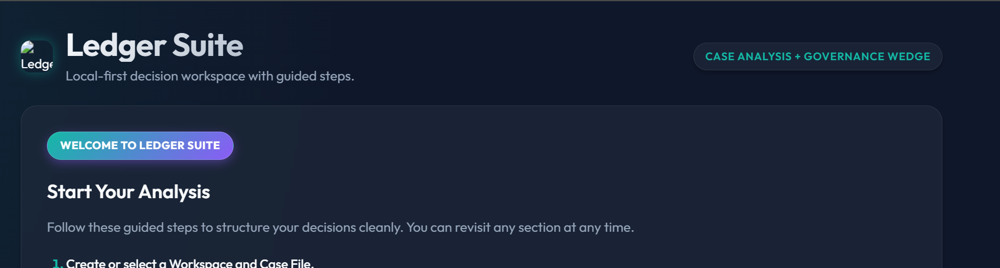

# Ledger Suite 

**Ledger Suite** is an offline-first managerial judgment and operational analysis workspace. It's designed for professionals, leaders, and operators who need a secure, fully private environment to draft decision memos, track evidence, weigh assumptions, and formulate strategies without worrying about data leaving their device.

🎉 **Try it out now:** Just open the application URL in your modern browser! 

---

### 🛡️ 100% Private, 100% Offline-First
Privacy is not an afterthought—it's the core architecture. Ledger Suite operates securely within your browser. 
- **Zero Cloud Lock-in**: There are no servers, no telemetry, and no accounts required. 
- **Your Data is Yours**: All work is saved directly to your device's local memory (via IndexedDB). 
- **Offline Reliability**: Because it is a Progressive Web App (PWA), you can install Ledger Suite to your desktop or mobile device and use it on an airplane or in a secure facility with absolutely no internet connection.

---

### ✨ Key Features

- **Guided Decision Workflows**: Contextual placeholder tips guide you through building robust Decision Memos to tackle complex cases head on.
- **Evidence & Assumption Tracking**: Document facts alongside confidence-weighted assumptions to evaluate options rationally.
- **Outcome & Governance Reviews**: Build structured review matrices for accountability, compliance, and tradeoff analysis. 
- **Export & Backup Confidence**:
  - **JSON & ZIP Snapshots**: Instantly back up or migrate your entire workspace data seamlessly across devices with deterministic integrity checksums ensuring no data is corrupted. 
  - **Staged Imports**: Safely preview data from snapshot files before atomic integration into your workflow. 
  - **Printable Briefs**: Export clean, distraction-free markdown files, or print perfectly formatted briefs directly to PDF.
- **Beautiful Glassmorphic Interface**: Enjoy a premium, dynamic, and responsive dark/light adaptive interface tailored for all screen sizes.

---

### 🚀 Getting Started

1. **Open the App**: Simply visit the GitHub Pages link hosting this repository.
2. **Setup a Workspace**: Start by creating a new `Workspace` and a new `Case`.
3. **Analyze**: Follow the 4-step analysis protocol:
   - *Step 1*: Frame your decision.
   - *Step 2*: Gather your evidence.
   - *Step 3*: Track assumptions & options.
   - *Step 4*: Review matrix and lock your outcomes.
4. **Install**: Click the "Install App" button in your browser's address bar to use Ledger Suite as a native-feeling standalone application.

---

### 💾 Backup Best Practices
Because all your workspaces live locally on your browser:
- **Remember to save frequent snapshot backups!** Use the **Export as ZIP** or **JSON Snapshot** buttons and save those files somewhere secure (like a personal cloud or encrypted drive) to protect against accidental browser cache clearance.
- **Before clearing browser cookies/site data**, ensure you run a complete export.

---

*Ledger Suite v0.1.41 - Fast. Private. Sovereign.*
